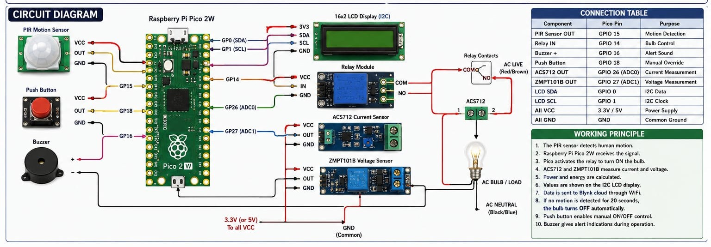

⚡ Motion Activated Smart Load Control and Power Monitoring System

🏆 Hackathon Project

Team Name

TECH FUSION

Team Members

- Vivek S
- Thejas BC
- Hemanth H
- Shivkumar A
- Sachit N Mandre

---

📌 Project Overview

The Motion Activated Smart Load Control and Power Monitoring System is an energy-efficient automation solution designed to reduce unnecessary power consumption.

The system uses a PIR Motion Sensor to detect human presence. When motion is detected, the Raspberry Pi Pico 2W automatically activates an AC load through a relay module. The system continuously monitors voltage and current consumption using dedicated sensors and displays real-time information on a 16x2 LCD display.

If no motion is detected for a predefined duration, the load is automatically switched OFF, helping conserve energy and improve efficiency.

---

🎯 Problem Statement

Design an ultra-low-power motion-activated system that:

- Detects human presence using a PIR sensor
- Activates electrical loads only when required
- Monitors real-time power consumption
- Displays system status and measurements
- Minimizes unnecessary energy usage
- Supports smart automation applications

---

💡 Proposed Solution

Our solution integrates a Raspberry Pi Pico 2W, PIR Motion Sensor, Relay Module, LCD Display, ACS712 Current Sensor, and ZMPT101B Voltage Sensor.

When motion is detected, the Pico activates a relay to switch ON an AC load. Simultaneously, the voltage and current sensors monitor electrical parameters and display them on the LCD.

When the monitored area becomes vacant, the system automatically switches OFF the connected load, reducing energy wastage.

---

✨ Key Features

✅ Motion-based load control

✅ Automatic switching of AC appliances

✅ Real-time voltage monitoring

✅ Real-time current monitoring

✅ LCD status display

✅ Energy-efficient operation

✅ Low-cost implementation

✅ Smart automation capability

✅ Reduced power wastage

---

🛠 Hardware Components

Component| Quantity
Raspberry Pi Pico 2W| 1
PIR Motion Sensor| 1
16x2 LCD Display (I2C)| 1
Relay Module| 1
ACS712 Current Sensor| 1
ZMPT101B Voltage Sensor| 1
Push Button| 1
AC Bulb / Load| 1
Connecting Wires| As Required

---

🏗 System Architecture

Motion Detection Flow:

PIR Motion Sensor

↓

Raspberry Pi Pico 2W

↓

Relay Control

↓

AC Load (Bulb)

↓

Voltage & Current Monitoring

↓

LCD Display

↓

Automatic Load Shutdown

---

⚙ Working Principle

Step 1: Motion Detection

The PIR sensor continuously monitors the surrounding environment for human movement.

Step 2: Motion Trigger

When motion is detected, the PIR sensor sends a signal to the Raspberry Pi Pico 2W.

Step 3: Load Activation

The Pico activates the relay module, which switches ON the connected AC load.

Step 4: Power Monitoring

The ACS712 Current Sensor and ZMPT101B Voltage Sensor measure electrical parameters in real time.

Step 5: Data Display

Voltage, current, and system status information are displayed on the 16x2 LCD.

Step 6: Energy Saving

If no motion is detected for a specified duration, the relay automatically switches OFF the connected load.

---

🔌 Circuit Diagram

## Circuit Diagram

---

📷 Hardware Setup

Hardware Prototype

"Hardware Setup" (hardware_setup.jpg)

---

📊 Project Presentation

[📥 Download Presentation](Smart_Motion_Alert_Circuit_PPT.pptx)
---

💻 Software Used

- MicroPython
- Thonny IDE
- GitHub
- Raspberry Pi Pico SDK

---

📁 Source Code Structure
# 📁 Source Code

[View Source Code](code/main.py)

---

🚀 Applications

- Smart Home Automation
- Automatic Room Lighting
- Office Energy Management
- Classroom Automation
- Smart Buildings
- Energy Conservation Systems
- Motion-Based Appliance Control
- Industrial Monitoring

---

📊 Expected Outcome

The developed system successfully:

- Detects human presence in real time
- Automatically controls electrical loads
- Reduces unnecessary power consumption
- Monitors voltage and current continuously
- Displays system information on LCD
- Improves energy efficiency
- Supports smart automation applications

---

🔮 Future Scope

- IoT Cloud Integration
- Mobile Application Monitoring
- Wi-Fi-Based Remote Control
- Energy Usage Analytics
- Smart Building Integration
- AI-Based Occupancy Detection
- Multiple Load Control System

---

🏅 Innovation Highlights

- Motion-based energy management
- Real-time power monitoring
- Automatic appliance control
- Low-cost implementation
- Scalable architecture
- Smart automation capability
- Energy conservation focused
- Suitable for homes, offices, and institutions

---

📜 License

This project is licensed under the MIT License.

---

🙏 Acknowledgements

Special thanks to the hackathon organizers, mentors, faculty members, and team members for their support and guidance throughout the project development process.
